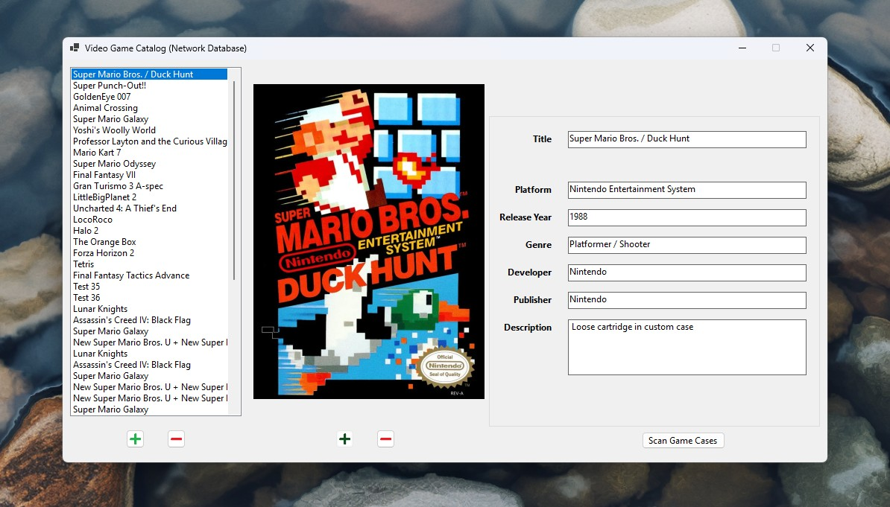
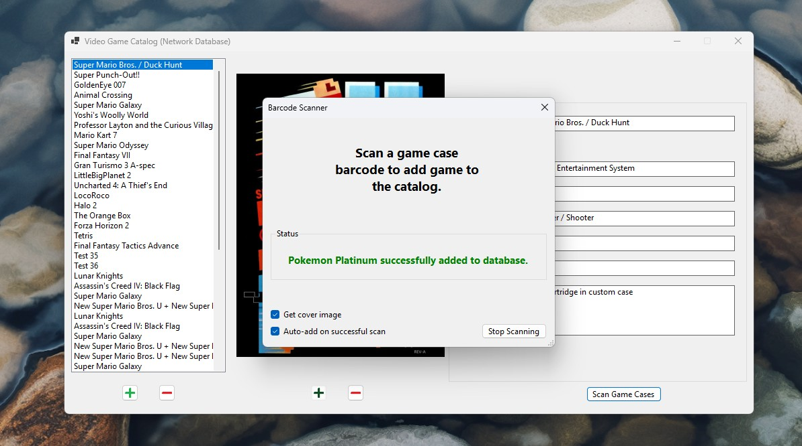

# Video Game Catalog - WinForms

This is a WinForms CRUD app for cataloging a physical video game collection. Using a USB barcode scanner, it finds video game details and cover images and saves them in a SQL Server database with no other interaction required. Just scan game cases one after another to add them to the catalog.

Main Window

Barcode Scanning
